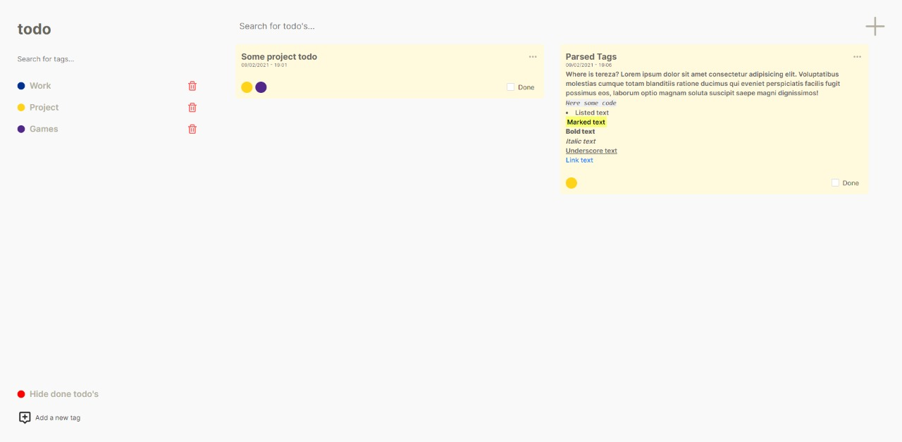
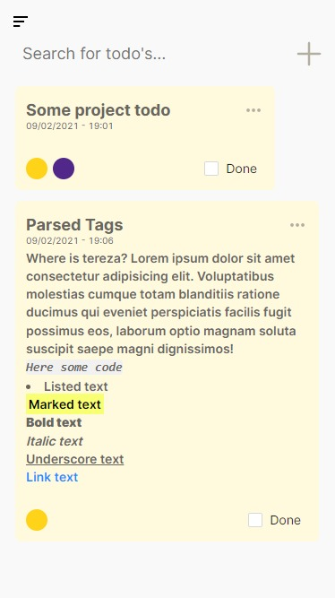
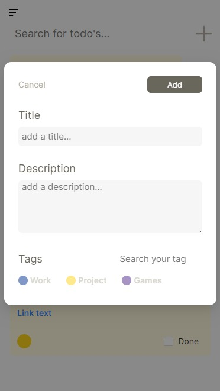

<p align="center">
 
</p>

<h3 align="center">Project TODO</h3>

<div align="center">

[]()
[](https://github.com/AntonioGally/todo-list/issues)
[](https://github.com/AntonioGally/todo-list/pulls)
[](/LICENSE)

</div>

---

<p align="center"> This project was designed to learn new technologies and practices in the React js development environment.<br/>
<a href="https://gally-list.netlify.app/#/">DEMO</a>
</p>

## 📝 Table of Contents

- [About](#about)
- [Getting Started](#getting_started)
- [Usage](#usage)
- [Built Using](#built_using)
- [Authors](#authors)

## 🧐 About <a name = "about"></a>


The "todo list" started when I was thinking of some project to apply drag and drop technology. From that moment on, I started to structure the idea and purpose of the project.
In addition to the features that I had already thought of adding, I also wanted to implement a synchronization algorithm with some database, in this case, firebase. The idea is: The app handles state changes by updating the database.

<p style="text-align:center; width:100%">
    
    
    
</p>

## 🏁 Getting Started <a name = "getting_started"></a>

These instructions will get you a copy of the project up and running on your local machine for development and testing purposes.
### Prerequisites

```
Node 14
Yarn 1.22
Git bash 2.32
Visual Studio Code
```

### Installing

A step by step series of examples that tell you how to get a development env running.

```
Clone the repo -> git clone https://github.com/AntonioGally/todo-list.git
Open on your vsCode -> code ./todo-list
Install dependencies -> yarn install
Run the project -> yarn start
```
## 🎈 Usage <a name="usage"></a>

<p>
    Be first, add some tags to your todo list, and after, you add your todo with the tag that you already added.
</p>
<p>
    Code List:

    <br> Line braker
    <li>Listed text</li>
    <code>Codded text</code>
    <mark>Marked text</mark>
    <b>Bold text</b>
    <i>Italic text</i>
    <u>Underscore text</u>
    <link adress="www.google.com">Link text</link>
</p>
## ⛏️ Built Using <a name = "built_using"></a>

- [React](https://pt-br.reactjs.org/) - Web framework

## ✍️ Authors <a name = "authors"></a>

- [@AntonioGally](https://github.com/AntonioGally) - Idea & Initial work
- [Nada Ishtewi](https://www.behance.net/gallery/107935847/Todo-List-Desktop-Mobile-app-UI-Design?tracking_source=search_projects_recommended%7Ctodo%20list%20ui%20design) - Project Design
